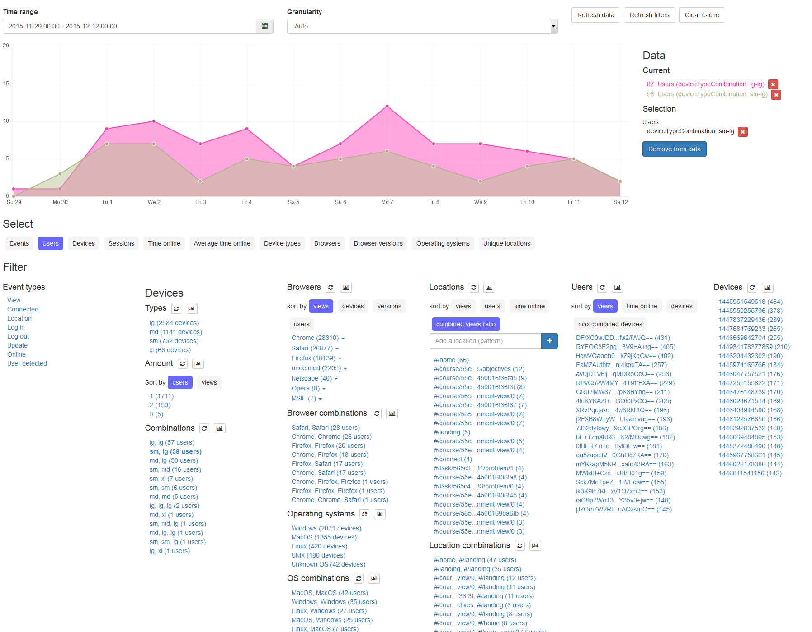

# XD-Analytics

XD-Analytics is a cross-device analytics platform. It allows to track multi-device usage of web applications with a focus on detecting parallel usage patterns. The user interface is based on concepts from faceted search.



## About this Project
XD-Analytics is under development at the [Globis Group at ETH Zürich](https://globis.ethz.ch). The project is coordinated by [Maria Husmann](https://globis.ethz.ch/#!/person/maria-husmann/). [Nicola Marcacci Rossi](https://github.com/nicolamr) has contributed to XD-Analytics.


## Setup

Clone this repository.

### Server

Install meteor.

#### Configure

Copy the example settings:

```
cp platform/config/settings.example.json platform/config/settings.json
```

Adapt the settings if needed.

#### Start

Type:

```
cd platform
meteor --settings config/settings.json --port 8080
```

#### Register an application

Visit the application, login with the credentials set in the settings file, and create an application. Note the AppID and the APIKey which you will need to configure the tracker.

### Tracker

Assuming the directory structures of the project to be tracked is

```
.
├── xd-analytics
│   ├── tracker
├── project
│   ├── bower.json
```

Then your `bower.json` dependency should look like:

```
{
	...
  "dependencies": {
		...
		"xd-analytics": "../xd-analytics/tracker",
		...
	}
	...
}
```

Include the ```xd-analytics.js``` and its dependencies:

```
<script src="bower_components/ddp.js/src/ddp.js"></script>
<script src="bower_components/moment/min/moment-with-locales.js"></script>
<script src="bower_components/cryptojslib/rollups/md5.js"></script>
<script src="bower_components/cryptojslib/components/enc-base64-min.js"></script>
<script src="bower_components/xd-analytics/xd-analytics.js"></script>
```

Then initialize `XDAnalytics` with the needed values:

```
	new XDAnalytics({
		server: <server>,
		port: <port>,
		appId: <appid>,
		apiKey: <apikey>,
		debug: false
	}, <userid>).connect();
```

## Analysis

To visualize data, you need to run the preprocessing algorithm (this might take a while). Open the meteor shell

```
meteor shell
```

Then in the shell type:

```
Meteor.computeInitialIntervals()
Meteor.computeDeviceIntervals()
Meteor.computeUserIntervals()
Meteor.computeFinalIntervals()
```

Now the data is available in the XD-Analytics UI.

## Development

The important folders are `platform/client/apps`, `platform/models/apps` and `platform/server/apps`.
